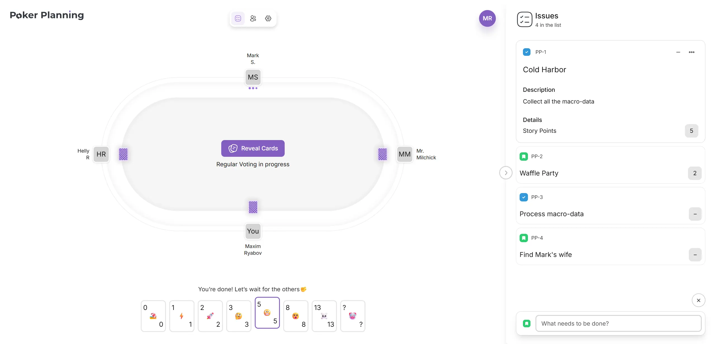

# Poker Planning Web (Frontend Part)

A real-time collaborative planning poker application for agile teams.

🔗 **[Live Demo](httpd://poker-planning.io)**

## Features (on Dec 2025)

-   🎯 Real-time voting updates
-   📊 Voting results visualization
-   🎨 Accessible UI with React Aria
-   ✨ Easy issue management

## Tech Stack (on Dec 2025)

-   Next.js 16 (App Router) + React 19
-   TypeScript, Zustand, SignalR
-   React Aria, Tailwind CSS v4, GSAP
-   Vitest, Playwright, Storybook

A more up-to-date version of the stack can be found in [package.json](package.json)

## Motivation

Please, check out my [post on LinkedIn](https://www.linkedin.com/pulse/solo-field-part-i-why-decided-one-man-band-maxim-ryabov-pvsnf/).

You can also find more details about this project and my decisions in it in the [ADR section](docs/adr/).

## Development Workflow

All changes go through feature branches with CI checks (unit tests, accessibility tests, build) required to pass before merging. See [CI/CD ADR](docs/adr/007-cicd-workflow.md) for details.

## CI/CD and Infrastructure

-   Docker, Github Actions, Digital Ocean VPS

## Links

🔗 [Backend Part](https://github.com/mx-ryabov/poker-planning-backend) (.NET 9, EF Core, PostgreSQL, SignalR)

## License

This project is for portfolio/learning purposes.
