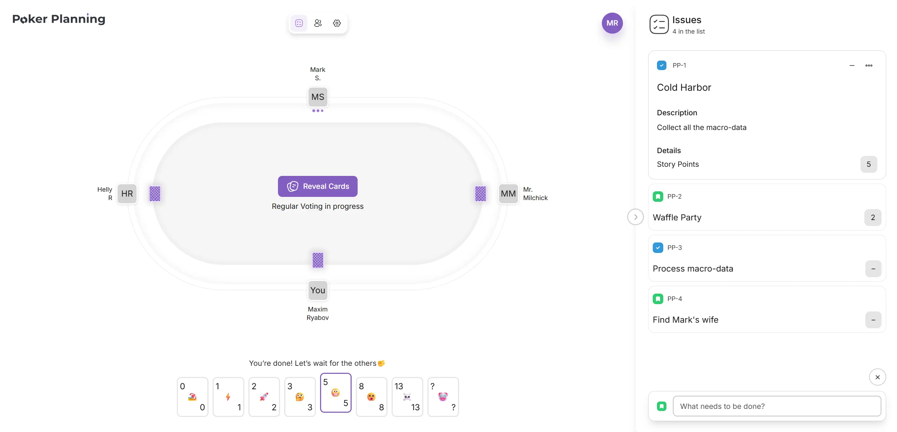

# Poker Planning - Monorepo

A real-time collaborative planning poker application for agile teams.

🔗 **[Live Demo](https://poker-planning.io)**



## Monorepo Structure

This repository uses **Turborepo** to manage a monorepo containing both frontend and backend applications.

```
poker-planning/
├── apps/
│   ├── frontend/    # Next.js 16 + React 19
│   └── backend/     # .NET 9 API
├── turbo.json       # Turborepo configuration
└── package.json     # Root workspace configuration
```

## Tech Stack

### Frontend
- Next.js 16 (App Router) + React 19
- TypeScript, Zustand, SignalR
- React Aria, Tailwind CSS v4, GSAP
- Vitest, Playwright, Storybook

### Backend
- .NET 9, ASP.NET Core
- Entity Framework Core, PostgreSQL
- SignalR for real-time communication

A more up-to-date version of the stack can be found in each app's `package.json` or project file.

## Getting Started

### Prerequisites
- Node.js >= 20
- pnpm >= 10
- .NET 9 SDK (for backend)

### Installation

```bash
# Install dependencies for all apps
pnpm install

# Start all apps in development mode
pnpm dev

# Start specific app
pnpm --filter @poker-planning/frontend dev
```

### Available Commands

```bash
pnpm dev          # Start all apps in dev mode
pnpm build        # Build all apps
pnpm test         # Run all tests
pnpm lint         # Lint all apps
pnpm type-check   # Type check all apps
```

## Features

-   🎯 Real-time voting updates
-   📊 Voting results visualization
-   🎨 Accessible UI with React Aria
-   ✨ Easy issue management

## Motivation

Please check out my [post on LinkedIn](https://www.linkedin.com/pulse/solo-field-part-i-why-decided-one-man-band-maxim-ryabov-pvsnf/).

You can also find more details about this project and my decisions in the [ADR section](docs/adr/).

## Development Workflow

All changes go through feature branches with CI checks (unit tests, accessibility tests, build) required to pass before merging. See [CI/CD ADR](docs/adr/007-cicd-workflow.md) for details.

## CI/CD and Infrastructure

-   Docker, Github Actions, Digital Ocean VPS
-   Turborepo for build caching and task orchestration

## License

This project is for portfolio/learning purposes.
