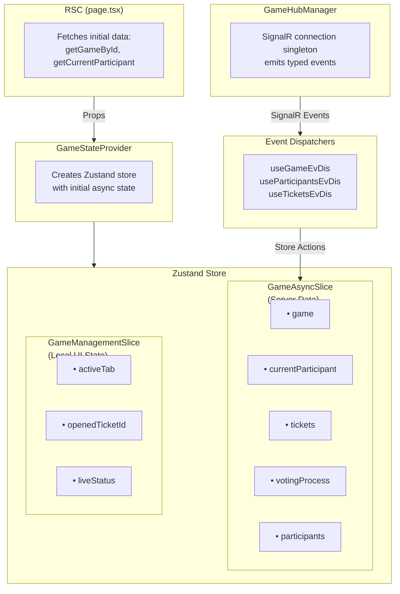

# ADR-004: Game State Management Choice

**Status**: Accepted  
**Date**: December 2025  
**Updated**: January 2026

## Context

The game room page requires real-time collaborative state management where multiple participants interact with shared data (votes, tickets, settings). We needed to decide between:

1. **Async state management libraries** (React Query, SWR)
2. **Client-side store** (Zustand with slices)

## Decision

**Keep Zustand for the game page. Consider React Query/SWR for traditional request/response pages (admin panel, etc.).**

## Rationale

### Why NOT React Query/SWR for Game Page

1. **No concurrency problem** — Data is fetched server-side (RSC) on initial render and passed to client
2. **Real-time via SignalR** — We push updates from server, not poll. Direct store updates via event dispatchers are simpler than `queryClient.setQueryData()`
3. **No caching benefit** — Data changes frequently; stale-while-revalidate pattern doesn't apply
4. **Easier testing** — Centralized store can be tested without mocking providers

### Why Zustand Works Well

1. **Slice separation** — `GameAsyncSlice` (server data) vs `GameManagementSlice` (local UI state)
2. **Immer integration** — Clean immutable updates for nested game state
3. **SignalR integration** — Event handlers directly call store actions
4. **Selective persistence** — Only UI state (`activeTab`, `openedTicketId`) persists, not server data

### Where React Query/SWR Would Help

-   **Admin panel** — Traditional CRUD with caching benefits
-   **Create game page** — Form submission with loading states
-   **Data that benefits from background refetching**

## Architecture



## Mutation Pattern

Custom `useMutation` hook (`src/shared/lib/hooks/use-mutation.ts`) provides:

-   Zod validation before request
-   `useTransition` for non-blocking updates
-   Callbacks: `onMutate`, `onSuccess`, `onError`

### Optimistic Updates

The hook does **not** include optimistic updates by itself. Use React's `useOptimistic` alongside `onMutate`:

```tsx
// Example: use-ticket-update.ts
const [optimisticData, mutateOptimistic] = useOptimistic<
	GameTicket,
	TicketItemState
>(defaultData, (state, optimisticData) => ({ ...state, ...optimisticData }));

const { mutate } = useMutation({
	mutateFn: (data) => api.updateTicket(ticketId, data),
	onMutate: mutateOptimistic, // Apply optimistic update immediately
	onSuccess: (data) => updateTicketInStore(ticketId, data),
	onError: (e) => {
		/* optimistic state auto-reverts on error */
	},
});
```

### Toast Notifications

Toast notifications are also handled separately via `onSuccess`/`onError` callbacks:

```tsx
// Example: use-start-voting.ts
const toast = useGlobalToast();

const { mutate } = useMutation({
	mutateFn: (ticketId) => api.startVoting(gameId, ticketId),
	onSuccess: (response, ticketId) => startVotingInStore(ticketId, response),
	onError: (error) =>
		toast?.add(
			{
				title: `Starting Voting failed. ${error.message}`,
				variant: "error",
				description: "Please try again",
			},
			{ timeout: 5000 },
		),
});
```

## Consequences

### Positive

-   Simple mental model for real-time data
-   No cache invalidation complexity
-   Store is single source of truth
-   Testable without network mocks

### Negative

-   Manual implementation of features RQ provides (retries, debounce) — see `plans/use-mutation-improvements.md`
-   Need to maintain separate solution if using RQ elsewhere
-   No DevTools out of box (but Zustand supports Redux DevTools)

## Future Considerations

1. **Admin panel** — Evaluate React Query when implementing
2. **Optimistic updates** — Document current pattern, consider structured rollback
3. **useMutation improvements** — Add debounce, retry logic as needed

## Related

-   `src/app/(game)/game/[id]/_store/` — Store implementation
-   `src/app/(game)/game/[id]/_events/` — SignalR + event dispatchers
-   `plans/use-mutation-improvements.md` — Planned hook improvements
