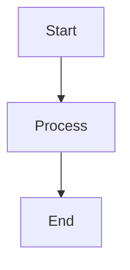
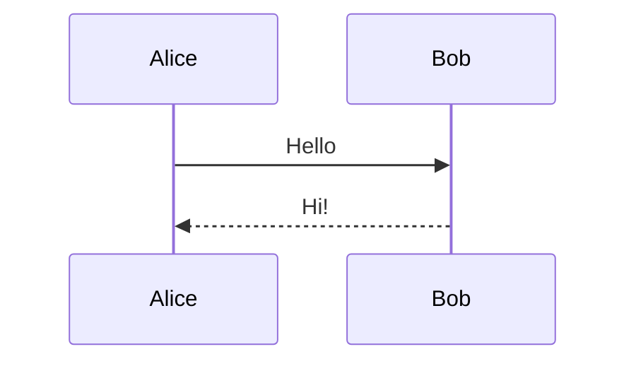
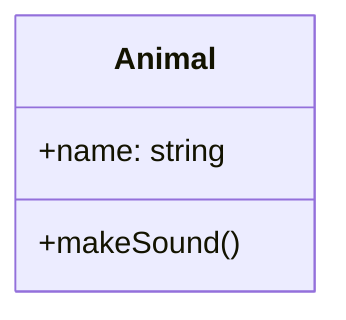

# Architecture Documentation

This directory contains architecture diagrams and documentation using Mermaid.

## 📊 Viewing Diagrams

### In VS Code or Cursor (Recommended)

1. **Install Extension**: [Markdown Preview Mermaid Support](https://marketplace.visualstudio.com/items?itemName=bierner.markdown-mermaid)

    ```bash
    code --install-extension bierner.markdown-mermaid
    ```

2. **View Diagrams**:
    - Open any `.md` file
    - Press `Ctrl+Shift+V` (Windows/Linux) or `Cmd+Shift+V` (Mac)
    - Diagrams render automatically!

### On GitHub

-   Mermaid diagrams render automatically when viewing markdown files
-   No setup needed!

### In Browser

-   Open [Mermaid Live Editor](https://mermaid.live/)
-   Copy/paste any mermaid code block
-   Edit and export as needed

## 📚 Available Documentation

### [Frontend Architectural Design](./frontend-architectural-design.md)

Project structure, layer organization, import rules, and enforcement. Start here to understand how code is organized.

### [Permission System](./permission-system.md)

Permission system architecture, patterns, and extension examples.

## ✏️ Editing Diagrams

All diagrams are in Mermaid text format within the markdown files. To edit:

1. Open the markdown file in any text editor
2. Find the mermaid code block (starts with ` ```mermaid `)
3. Edit the text
4. Preview to see changes

### Quick Mermaid Syntax

````markdown
# Flowchart


````

# Sequence Diagram



# Class Diagram



```

## 🔗 Resources

- [Mermaid Documentation](https://mermaid.js.org/)
- [Mermaid Live Editor](https://mermaid.live/)
- [Flowchart Syntax](https://mermaid.js.org/syntax/flowchart.html)
- [Sequence Diagram Syntax](https://mermaid.js.org/syntax/sequenceDiagram.html)
- [Class Diagram Syntax](https://mermaid.js.org/syntax/classDiagram.html)

```
