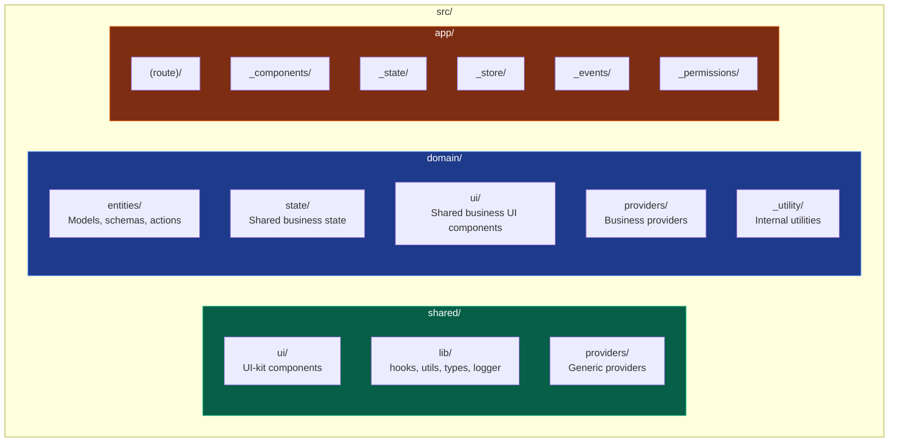
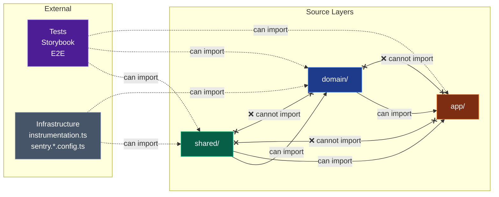
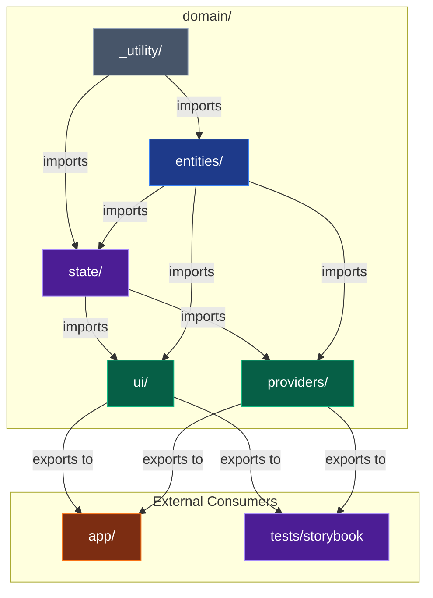

# Frontend Architectural Design

This document describes the frontend project structure, layer organization, import rules, and constraints. For the decision context and rationale behind this architecture, see [ADR-002](../adr/002-frontend-architecture-design-choice.md).

---

## Overview

The architecture follows a **three-layer structure** with clear separation of concerns and **unidirectional dependency flow**:

```
shared → domain → app
```

Each layer has specific responsibilities and import rules enforced by [dependency-cruiser](#enforcement).

---

## Project Structure



### Folder Structure

```
src/
├── shared/          # Non-business logic (importable anywhere)
│   ├── ui/          # UI-kit components (Button, Modal, Input, etc.)
│   ├── lib/         # Hooks, utils, types, logger
│   └── providers/   # Generic providers (confirmation modals, toasts, etc.)
│
├── domain/          # Business logic (importable in app, root infra/tests)
│   ├── entities/    # Business models, schemas, server actions, permissions
│   ├── state/       # Shared business state
│   ├── ui/          # Business-specific UI components
│   ├── providers/   # Business providers (API, auth, etc.)
│   └── _utility/    # Internal utilities (not part of public API)
│
└── app/             # Next.js App Router (not importable, except tests)
    └── (route)/
        ├── _components/   # Page-specific UI
        ├── _state/        # Page-specific state
        ├── _store/        # Page-specific stores
        ├── _events/       # Page-specific event handlers
        ├── _permissions/  # Page-specific permission checks
        ├── page.tsx
        └── layout.tsx
```

---

## Layer Import Rules



### Summary

| Layer | Can be imported by |
|-------|-------------------|
| `shared/` | Anywhere |
| `domain/` | `app/`, infrastructure files, tests, storybook |
| `app/` | Only tests (internal imports within app allowed) |

---

## Layer Specifications

### 1. Shared Layer

Contains **non-business logic** that can be imported anywhere in the project.

| Folder        | Purpose                                          | Examples                                         |
| ------------- | ------------------------------------------------ | ------------------------------------------------ |
| `ui/`         | Generic UI components without business knowledge | Button, Modal, Input, Toast, Icon                |
| `lib/hooks/`  | Reusable hooks                                   | useClickOutside, useLocalStorage, useMutation    |
| `lib/utils/`  | Utility functions                                | mergeClassNames, validation, stringHelper        |
| `lib/types/`  | Generic TypeScript types                         | DeepPartial, RequiredField, RenderFn             |
| `lib/logger/` | Logging infrastructure                           | logger, sentryLogger                             |
| `providers/`  | Generic providers without business logic         | ConfirmationModalProvider, CookieConsentProvider |

---

### 2. Domain Layer

Contains **shareable business logic** organized into sub-layers with specific import rules.

#### 2.1 Entities (`domain/entities/`)

Business models, schemas, server actions, and entity-specific logic.

```
domain/entities/
├── game/
│   ├── models/          # TypeScript interfaces and types
│   ├── schemas/         # Zod/validation schemas
│   ├── actions/         # Server actions
│   ├── permissions/     # Entity-specific permission definitions
│   └── index.ts         # Public API
├── user/
│   └── ...
└── voting-system/
    └── ...
```

#### 2.2 State (`domain/state/`)

Business state that needs to be shared across multiple pages.

#### 2.3 UI (`domain/ui/`)

Business-specific UI components that should be imported across different pages.

#### 2.4 Providers (`domain/providers/`)

Business providers that manage domain-specific context.

#### 2.5 Utility (`domain/_utility/`)

Internal domain utilities. The underscore prefix indicates this is **not part of the public domain API**.

#### Domain Internal Import Rules



| Sub-layer    | Can import from                    | Can be imported by                         |
| ------------ | ---------------------------------- | ------------------------------------------ |
| `entities/`  | shared, \_utility                  | Anywhere in domain and app/                |
| `state/`     | shared, entities, \_utility        | ui/, providers/ and app/                   |
| `ui/`        | shared, entities, state, \_utility | app/, infra, tests, storybook (NOT domain) |
| `providers/` | shared, entities, state, \_utility | app/, infra, tests, storybook (NOT domain) |
| `_utility/`  | shared                             | Anywhere in domain (NOT shared, NOT app)   |

#### Domain Dependency Flow

```
_utility (internal utilities, importable by all domain sublayers)
    ↓
entities (foundation, uses _utility)
    ↓
  state (uses entities + _utility)
    ↓
ui, providers (use entities + state + _utility, exit points to app)
```

---

### 3. App Layer

Contains **Next.js App Router pages** with co-located page-specific code.

**Import Rule:** Cannot be imported anywhere except for testing purposes. Internal imports within app are allowed.

#### Page Structure

Each page may have private folders (prefixed with `_`) for co-located code:

| Folder          | Purpose                                    |
| --------------- | ------------------------------------------ |
| `_components/`  | Page-specific UI components                |
| `_state/`       | Page-specific state and hooks              |
| `_store/`       | Page-specific stores (Zustand, etc.)       |
| `_events/`      | Page-specific event handlers/dispatchers   |
| `_permissions/` | Page-specific permission checks            |
| `_styles/`      | Page-specific styles (rare, for CSS files) |

#### Route Organization

When the number of folders (parts + nested routes) exceeds ~9:

- Group nested routes into route groups `(group-name)/`
- Keep page parts (`_components/`, `_state/`, etc.) at the page level

---

## Enforcement

The import rules are enforced using **dependency-cruiser** with the following setup:

### Configuration

Rules are defined in `.dependency-cruiser.js` at the project root.

### Pre-commit Hook

Architecture violations are checked on every commit via Husky:

```bash
# .husky/pre-commit
pnpm lint:deps
lint-staged
```

### Manual Check

Run the dependency check manually:

```bash
pnpm lint:deps
```

### Enforced Rules

| Rule Name | Description |
|-----------|-------------|
| `shared-not-to-domain` | shared/ cannot import from domain/ |
| `app-not-importable` | Code outside app/ cannot import from app/ (except tests) |
| `domain-ui-not-in-domain` | domain/ui/ cannot be imported within domain/ |
| `domain-providers-not-in-domain` | domain/providers/ cannot be imported within domain/ |
| `domain-state-not-in-entities-utility` | domain/state/ cannot be imported by entities/ or \_utility/ |
| `domain-utility-internal-only` | domain/\_utility/ cannot be imported from shared/ or app/ |
| `domain-entities-isolation` | entities/ cannot import from state/, ui/, or providers/ |
| `domain-state-isolation` | state/ cannot import from ui/ or providers/ |
| `domain-utility-isolation` | \_utility/ cannot import from other domain sublayers |

---

## Additional Guidelines

### Test File Location

- Test files should be co-located with the files they test
- When there are more than 5 test files in a directory, create a `__tests__/` folder

### Server and Client Components

No special file naming convention for server vs client components. Use `"use client"` directive as needed.

### Infrastructure Files

Root-level infrastructure files (`instrumentation.ts`, `sentry.*.config.ts`, etc.) can import from both `shared/` and `domain/`.

### Mocks and Test Utilities

The `__mocks__/` folder at the project root can import from anywhere for testing purposes.

