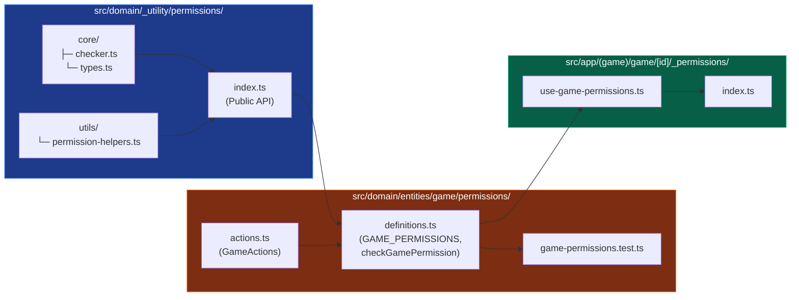
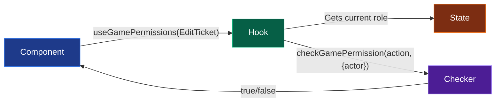
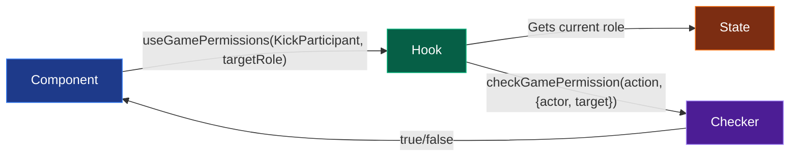
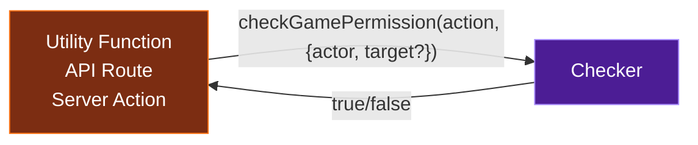
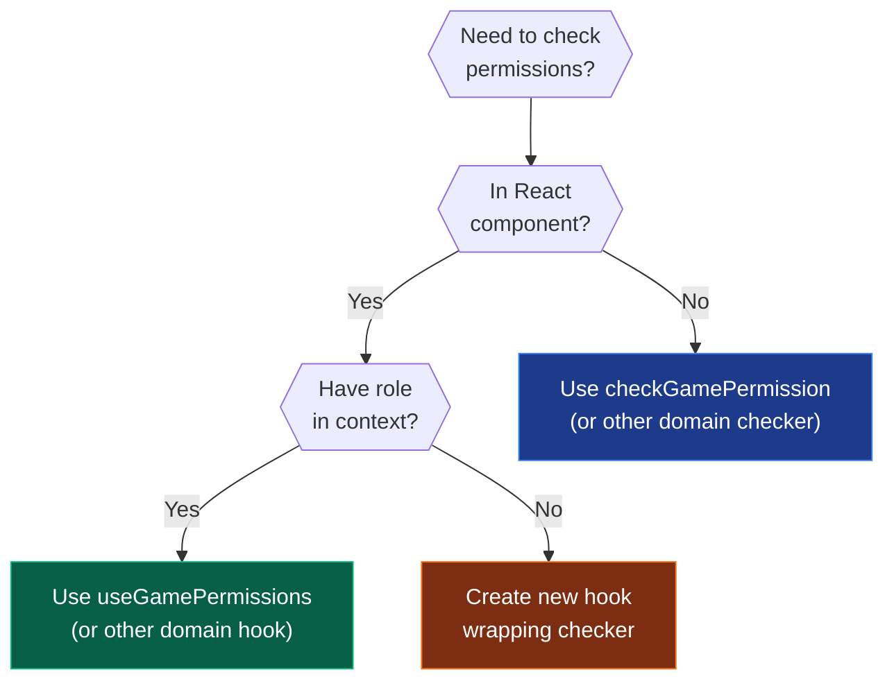

# Permission System Architecture

## Overview

The permission system is centralized in the `domain/_utility/permissions` module and contains all the core logic related to permissions in the app. It's organized into three parts:

-   Core - contains the `permissions checker factory` that is used to create a permissions checker for a specific domain (game, admin, etc), types, and utility functions
-   Entity Permissions - each domain entity (e.g., `game`) defines its own `actions`, `definitions` (permission rules), and pre-configured checker
-   Page (React integration) - optional layer for a specific page where you can define a hook as a wrapper for the corresponding permissionsChecker function in which you can pass all the necessary params from the state.

---

## File Structure



---

## Usage Patterns

### Pattern 1: Simple Permission Check



### Pattern 2: Permission with Target



### Pattern 3: Direct Checker Usage (Non-React)



---

## Extension Example: Adding Admin Permissions

### Step 1: Define Actions in Entity

```typescript
// src/domain/entities/admin/permissions/actions.ts
export const AdminActions = {
	ManageUsers: "admin:manage-users",
	ViewAnalytics: "admin:view-analytics",
	EditSettings: "admin:edit-settings",
} as const;

export type AdminActionType = (typeof AdminActions)[keyof typeof AdminActions];
```

### Step 2: Define Permissions and Create Checker

```typescript
// src/domain/entities/admin/permissions/definitions.ts
import {
	createPermissionChecker,
	createSimplePermission,
	PermissionMap,
} from "@/src/domain/_utility/permissions";
import { AdminRole } from "../models/admin-role";
import { AdminActions, AdminActionType } from "./actions";

const ADMIN_PERMISSIONS: PermissionMap<AdminActionType, AdminRole> = {
	[AdminActions.ManageUsers]: createSimplePermission([
		AdminRole.SuperAdmin,
		AdminRole.Admin,
	]),
	[AdminActions.ViewAnalytics]: createSimplePermission([
		AdminRole.SuperAdmin,
		AdminRole.Admin,
		AdminRole.Analyst,
	]),
	// ...
};

/**
 * Pre-configured permission checker for admin permissions.
 */
export const checkAdminPermission = createPermissionChecker<
	AdminRole,
	AdminActionType
>(ADMIN_PERMISSIONS);
```

### Step 3: Export from Entity Index

```typescript
// src/domain/entities/admin/index.ts
export * from "./permissions/definitions";
export { AdminActions, type AdminActionType } from "./permissions/actions";
```

### Step 4: Create Page Hook

```typescript
// src/app/admin/_permissions/use-admin-permissions.ts
import { useMemo } from "react";
import {
	AdminActionType,
	checkAdminPermission,
} from "@/src/domain/entities/admin";
import { AdminRole } from "@/src/domain/entities/admin";
import { selectCurrentRole, useAdminState } from "../_store";

export function useAdminPermissions(
	action: AdminActionType,
	targetRole?: AdminRole,
): boolean {
	const currentRole = useAdminState(selectCurrentRole);
	return useMemo(
		() =>
			checkAdminPermission(action, {
				actor: currentRole,
				target: targetRole,
			}),
		[currentRole, action, targetRole],
	);
}
```

### Step 5: Write Tests (Co-located with Definitions)

```typescript
// src/domain/entities/admin/permissions/admin-permissions.test.ts
import { describe, expect, test } from "vitest";
import { AdminRole } from "../models/admin-role";
import { checkAdminPermission } from "./definitions";
import { AdminActions } from "./actions";

describe("Admin Permissions", () => {
	test.each([
		{ role: AdminRole.SuperAdmin, expectedResult: true },
		{ role: AdminRole.Admin, expectedResult: true },
		{ role: AdminRole.Analyst, expectedResult: false },
	])(
		"ManageUsers: SuperAdmin and Admin are allowed - role: $role",
		({ role, expectedResult }) => {
			const result = checkAdminPermission(AdminActions.ManageUsers, {
				actor: role,
			});
			expect(result).toBe(expectedResult);
		},
	);
});
```

---

## Decision Flow: When to Use Each Layer



---

## Summary

### File Locations

-   **Core Logic**: `src/domain/_utility/permissions/`
    -   `core/checker.ts` - Factory function
    -   `core/types.ts` - Permission types
    -   `utils/permission-helpers.ts` - Utility functions (e.g., `createSimplePermission`)
-   **Entity Permissions**: `src/domain/entities/{entity}/permissions/`
    -   `actions.ts` - Action type definitions
    -   `definitions.ts` - Permission definitions and pre-configured checker
    -   `{entity}-permissions.test.ts` - Permission tests
-   **React Hooks**: `src/app/{route}/_permissions/`
    -   `use-{domain}-permissions.ts` - Domain-specific hook

### Quick Reference

```typescript
// 1. Pre-configured checker (from entity)
import { checkGamePermission } from "@/src/domain/entities/game";

// 2. Use in React components
import { useGamePermissions, GameActions } from "./_permissions";

const canEdit = useGamePermissions(GameActions.EditTicket);
const canKick = useGamePermissions(GameActions.KickParticipant, targetRole);

// 3. Use outside React (utility functions, API routes, etc.)
import { checkGamePermission, GameActions } from "@/src/domain/entities/game";

if (checkGamePermission(GameActions.EditTicket, { actor: role })) {
	// User is allowed to edit
}
```
